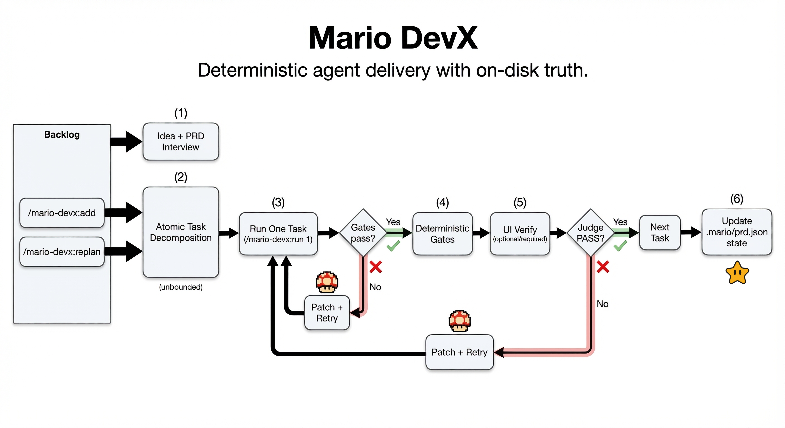

# 👾 Mario DevX


Named after Super Mario because (1) it never stops running, (2) it repeatedly smashes its face into the same level until it learns where the invisible blocks are, and (3) because Italians always do it better 🇮🇹.

It does not "have a conversation" about shipping. It ships, fails a gate, reads the receipt, and tries again.
If you're looking for vibes, inspirational essays, or a 200-message thread that ends with "should work," you're in the wrong repo.

**Mario DevX** is an OpenCode plugin that runs Ralph-style, file-based, deterministic agent loops inside the OpenCode TUI.

## Why you'll like it

- **Smart planning, deterministic execution**: LLM-driven PRD interview adapts to your project (no rigid forms), but task execution is strictly deterministic—quality gates must pass, verifiable output stored on disk (`.mario/*`), not fragile chat memory.
- Strict verifier output (`PASS|FAIL` + next actions) so failures are actionable.
- Incremental scope management (`/mario-devx:add`, `/mario-devx:replan`) without restarting from scratch.

## Loop overview



## 30-second quickstart

```bash
mkdir my-project && cd my-project && git init && \
curl -fsSL https://raw.githubusercontent.com/valerio-mc/mario-devx/main/install.sh | bash && \
opencode .
```

Then in OpenCode:

```text
/mario-devx:new your idea
/mario-devx:run 1
```

<br clear="right" />

## Motivations

Coding agents are great until the chat becomes the product: long threads, stale assumptions, and "it passed on vibes".

Mario DevX forces the only kind of memory that actually helps:
1. Put the truth on disk (`.mario/`), not in the chat.
2. Ship in small slices (one task per iteration).
3. Add backpressure (quality gates + strict judge) so the loop stops when it should.

## Commands

```
/mario-devx:new <idea>    # PRD wizard -> seeds .mario/prd.json (requirements + tasks)
/mario-devx:run <N>       # build + gates + judge for the next N tasks
/mario-devx:add <feature> # add a new feature request and decompose into new tasks
/mario-devx:replan        # regenerate open-task plan from backlog requests
/mario-devx:status        # what's running + focus task + last verdict + next action
/mario-devx:doctor        # healthcheck + concrete fixes
```

## Control vs Work session

```text
+-----------------------+        +---------------------------+        +---------------------+
| Control Session (you) |  --->  | Work Session (mario-devx) |  --->  | Canonical State     |
| (runs slash commands) |        | (build + verify + judge)  |        | (.mario/* on disk)  |
+-----------------------+        +---------------------------+        +---------------------+
```

## First run
1) **Create a repo**

```bash
mkdir my-project && cd my-project && git init
```

2) **Install the plugin files**

Use the same install command shown in **30-second quickstart**.

Re-running the installer is safe for upgrades:
- It overwrites `.opencode/plugins/mario-devx/` and `.opencode/plugins/mario-devx.ts` with the latest version.
- It merges dependencies into `.opencode/package.json` (does not clobber existing entries).
- It does **not** reset your `.mario/` state, so PRD/tasks progress is preserved.

3) **Start OpenCode**

```bash
opencode .
```

4) **Bootstrap**

```
/mario-devx:new my brilliant idea
```

Answer the PRD interview questions in your current session using natural language.

**How the PRD interview works:**

The PRD wizard is **fully LLM-driven**. Instead of following a rigid script, the LLM analyzes your PRD state and asks intelligent follow-up questions to fill in missing details. Just answer naturally - the LLM will:

- Analyze your current PRD state (idea, platform, requirements)
- Identify the most important missing field
- Ask ONE concise, high-leverage question
- Extract updates from your natural language answer
- Continue until all required fields are complete

**The LLM captures:**
- target users/problems + constraints + measurable outcomes
- runnable quality gates (project-defined backpressure)
- frontend UI conceptualization (design system, visual direction, UX requirements, optional style references)
- README policy for human-readable docs

**Style references:** You can mention URLs and/or screenshot paths anywhere in your answers. Mario DevX automatically extracts and merges them into your PRD.

Example:
- `Style references: https://linear.app, https://stripe.com, ./references/hero-layout.png`

**Task generation:** Once the PRD is complete, the LLM generates 5-15 tailored implementation tasks based on your specific requirements (not a rigid template). Simple ideas get fewer tasks; complex ideas get appropriate decomposition.

**No fixed options:** Unlike traditional wizards, there are no multiple-choice questions. Just describe what you want in natural language, and the LLM will understand.

5) **Run the loop**

```
/mario-devx:run <N>
```

`N` is the maximum number of tasks to attempt in this run.
Use `/mario-devx:run 1` for tight control (recommended), or a larger number to let it continue across multiple tasks until one fails or it reaches the limit.

Typical `/run` output:

```text
Run finished. Attempted: 1. Completed: 0. Stopped early due to failure.
Task: T-0004 (blocked) - Implement: ...
Gates: 3/4 PASS
UI verify: FAIL (required)
Judge: FAIL (exit=false)
Reason: Deterministic gate failed: npm run test (exit 1).
```

## Usage

### Sessions

- You run `/mario-devx:*` in your normal session (control session).
- The build/judge runs in a persistent per-repo work session internally; you generally do not need to open it.

### The loop

1) Set your Quality Gates in `.mario/prd.json` under `qualityGates` (commands only).
2) Run one iteration:

```
/mario-devx:run 1
```

To keep going:

```
/mario-devx:run 5
```

If it stops, the answer is in the focus task's `lastAttempt` verdict.

```
/mario-devx:status
```

Note: nothing runs code until you call `/mario-devx:run`.

Task order is scaffold-first by design:
- `T-0001`: scaffold baseline
- `T-0002`: setup quality pipeline (using PRD-defined gates)
- docs task (README) when enabled
- remaining tasks: feature implementation

Scaffold nuance:
- For web/TypeScript ideas in non-empty repos, the default scaffold may be created in `app/` (not root) to avoid clobbering existing files.
- Scaffold completion accepts either `package.json` at root or `app/package.json`.
- When scaffold lands in `app/`, mario-devx runs deterministic quality gates against that workspace and defaults UI dev command to `npm --prefix app run dev`.
- `T-0002` now auto-bootstraps missing baseline scripts (for example `typecheck`, `test:e2e`) in the active workspace before retrying gates.

You can add features at any time:

```text
/mario-devx:add add CSV export and saved filters
/mario-devx:replan
```

If your `/mario-devx:add` request is too vague, mario-devx will use an **LLM-driven clarification process** to decompose it into implementable tasks:

1. The LLM analyzes your feature request
2. Asks follow-up questions if needed (scope, acceptance criteria, constraints)
3. Decomposes into 2-5 atomic implementation tasks
4. Creates tasks with proper acceptance criteria

This is not a rigid multi-step form - the LLM adapts to your specific feature and asks only what's needed.

`/mario-devx:replan` also repairs malformed open feature tasks by canceling non-atomic fragments and regenerating clean atomic tasks from PRD/backlog.

## What gets created

In your project:

```text
.mario/
  prd.json                   # requirements + planning + tasks + backlog + verification policy
  AGENTS.md                  # harness knobs (UI_VERIFY*)
  state/state.json           # internal state (iteration, run status, work session ids)
```

In this repo:

```text
.opencode/plugins/mario-devx/   # OpenCode plugin source + assets
```

## Backpressure (Definition of Done)

Mario DevX uses a **three-layer verification pipeline** with heartbeat-based backpressure to ensure every task is properly validated before completion.

### Source of Truth

- **Quality Gates**: Defined in `qualityGates` array in `.mario/prd.json`
- **UI Verification**: Enabled when `frontend: true` (sets `UI_VERIFY=1`)
- **Run State**: Tracked in `.mario/state/run.lock` with continuous heartbeats

*Note: If `qualityGates` is empty, `/mario-devx:run` will refuse to run.*

### Verification Pipeline

```
  PHASE 1              PHASE 2              PHASE 3             RESULT
  ┌─────────┐          ┌─────────┐          ┌─────────┐        ┌─────────┐
  │  Gates  │          │   UI    │          │ Verifier│        │  Task   │
  │(determ- │    ▶     │(browser │    ▶     │  (LLM)  │   ▶    │ Status  │
  │ inistic)│          │  based) │          │         │        │         │
  └────┬────┘          └────┬────┘          └────┬────┘        └─────────┘
       │                    │                    │
       ▼                    ▼                    ▼
   heartbeat           heartbeat           heartbeat
       │                    │                    │
       └────────────────────┴────────────────────┘
                          │
                    run.lock updated
```

**Phase Details:**

| Phase | What It Does | Must Pass? |
|-------|--------------|------------|
| **1. Deterministic Gates** | Runs quality commands (test, lint, typecheck) | ✅ Always required |
| **2. UI Verification** | Uses `agent-browser` (Playwright) to verify frontend | ⚠️ Required if `UI_VERIFY_REQUIRED=1` |
| **3. LLM Verifier** | Final judgment based on all collected evidence | ✅ Always required |
| **Heartbeat** | Updates `run.lock` timestamp after each phase | ✅ Failure stops execution |

### UI Verification (Frontends)

When `frontend: true` in your PRD, mario-devx configures:
- `UI_VERIFY=1` - Enable UI verification
- `UI_VERIFY_REQUIRED=1|0` - Required or best-effort (from PRD interview)
- `UI_VERIFY_CMD` - Command to start dev server (e.g., `npm run dev`)
- `UI_VERIFY_URL` - URL to test (e.g., `http://localhost:3000`)

**Auto-install prerequisites:**
```bash
npm install -g agent-browser
agent-browser install
npx skills add vercel-labs/agent-browser
```

**What happens:**
1. Starts your dev server (`UI_VERIFY_CMD`)
2. Drives a real browser at `UI_VERIFY_URL` using Vercel's `agent-browser` (Playwright-based)
3. Captures snapshot, console logs, and errors
4. Stores result in `.mario/prd.json` under `tasks[].lastAttempt.ui`

### Backpressure Mechanism

The heartbeat system ensures safe, interruptible execution:

- **Before each phase**: Check `run.lock` exists and is valid
- **After each phase**: Update `run.lock` with new heartbeat timestamp  
- **On failure**: Stop execution immediately, mark task as `blocked`

*If the heartbeat cannot update the lock file (disk full, permissions, etc.), execution stops with actionable error.*

## Verifier output

The judge output is stored on the task in `.mario/prd.json` under `tasks[].lastAttempt.judge`.

The verifier now returns JSON for reliable parsing:

```json
<VERIFIER_JSON>
{
  "status": "PASS|FAIL",
  "reason": ["..."],
  "nextActions": ["..."]
}
</VERIFIER_JSON>
```

## Git hygiene

If you don't want internal state in git, add this to your repo `.gitignore`:

```gitignore
.mario/state/
```

## Troubleshooting

| Issue | Solution |
|-------|----------|
| **Wizard won't progress** | The PRD wizard is LLM-driven. Just answer naturally - it will ask follow-ups until complete. Check `.mario/prd.json` to see current state. |
| **Quality gates fail instantly** | Verify `.mario/prd.json` has runnable commands under `qualityGates` (e.g., `npm test`, `npm run lint`). |
| **First task keeps failing** | Check `tasks[0].lastAttempt.judge.nextActions` in `.mario/prd.json` for specific scaffold commands to run. |
| **UI verification won't run** | Ensure `.mario/AGENTS.md` has `UI_VERIFY=1`. If auto-install failed, run: `npm install -g agent-browser && agent-browser install` |
| **Verifier returns invalid JSON** | The LLM should return JSON in `<VERIFIER_JSON>` tags. If malformed, the task will be marked blocked - check `lastAttempt.judge.rawText` to see what was returned. |
| **AGENTS.md parse warnings** | Lines must be `KEY=VALUE` format. Comments start with `#`. No spaces around `=`. |
| **Run stops with heartbeat error** | Check disk space and permissions on `.mario/state/run.lock`. Clear the lock file if stuck: `rm .mario/state/run.lock` |
| **General health check** | Run `/mario-devx:doctor` to diagnose common issues. |

## Acknowledgements

- [Geoffrey Huntley + playbook](https://github.com/ghuntley/how-to-ralph-wiggum)
- [Resource index](https://github.com/snwfdhmp/awesome-ralph)
- [agent-browser (Vercel)](https://github.com/vercel-labs/agent-browser)

## License

MIT. See `LICENSE`.
